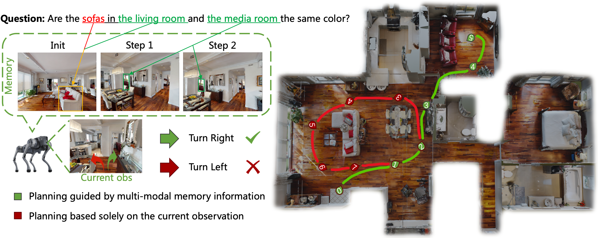
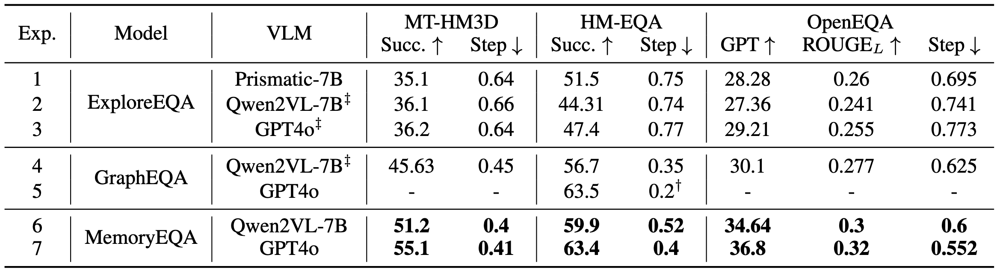

# Memory Embodied Question Answering

Official implementation of the paper **"Memory-Centric Embodied Question Answering"**.

In this paper, we propose a memory-centric EQA framework named MemoryEQA. 
Unlike planner-centric EQA models where the memory module cannot fully interact with other modules, MemoryEQA flexible feeds memory information into all modules, thereby enhancing efficiency and accuracy in handling complex tasks, such as those involving multiple targets across different regions.
Specifically, we establish a multi-modal hierarchical memory mechanism, which is divided into global memory that stores language-enhanced scene maps, and local memory that retains historical observations and state information. 
When performing EQA tasks, the multi-modal large language model is leveraged to convert memory information into the required input formats for injection into different modules.
To evaluate EQA models' memory capabilities, we constructed the MT-HM3D dataset based on HM3D, comprising 1,587 question-answer pairs involving multiple targets across various regions, which requires agents to maintain memory of exploration-acquired target information.

[Paper](https://arxiv.org/html/2505.13948v1), [Project](https://memory-eqa.github.io/)



# Installation
Set up the conda environment (Linux, Python 3.9):
```
conda env create -f environment.yml
conda activate explore-eqa
pip install -e .
```

Install the latest version of [Habitat-Sim](https://github.com/facebookresearch/habitat-sim) (headless with no Bullet physics) with:
```
conda install habitat-sim headless -c conda-forge -c aihabitat
```

Install [flash-attention2](https://github.com/Dao-AILab/flash-attention):
```
pip install flash-attn --no-build-isolation
```

Install [faiss-gpu](https://github.com/facebookresearch/faiss)
```
conda install -c conda-forge faiss-gpu
```

Install transformers for qwenvl
```
pip install git+https://github.com/huggingface/transformers
pip install qwen-vl-utils
```

Install [AutoGPTQ](https://github.com/AutoGPTQ/AutoGPTQ)
```
git clone https://github.com/PanQiWei/AutoGPTQ.git && cd AutoGPTQ
pip install -vvv --no-build-isolation -e .
```

# Dataset


- Huggingface: [link](https://huggingface.co/datasets/zmling/MT-HM3D)
- Baidu Cloud: coming soon
- Google Drive: coming soon

Download MT-HM3D, and file structure is as follow:
```
MemoryEQA
└─ data
    └─ MT-HM3D
```

# Inference on MT-HM3D
```
sh scripts/run_memory_eqa.sh
```

# Inference on Go2
Complete EQA tasks in real scenarios using Untree Go2.

## Unitree Go2
Your first need install [go2_dashboard](https://github.com/bentheperson1/go2_dashboard) on Unitree Go2.
```
cd go2_dashboard
python app.py
```

## Server
```
python server_wrapper/go2_flask.py # launch go2 interface
python server_wrapper/vlm_flask.py # launch qwen2vl server
sh scripts/run_vlm_real.sh
```

# Results
Experiments on multiple methods across MT-HM3D, HM-EQA, and OpenEQA, testing various foundational models. $^\dagger$ denotes that the value was converted based on the metrics provided in the original paper. $\ddagger$ indicates that the performance was obtained through our replication.

On MT-HM3D, MemoryEQA attains a success rate of 54.5\%, outperforming baseline by 18.9\% (Exp.3), highlighting the critical role of hierarchical memory in multi-target tasks. The results demonstrate that MemoryEQA exhibits superior performance in multi-modal reasoning tasks, particularly in complex scene understanding and knowledge integration.


# Citation
If you find our paper and code useful in your research, please consider giving a star ⭐ and citation 📝 (´▽`ʃ♡ƪ)
```
@inproceedings{gao2025multi,
    title={Memory-Centric Embodied Question Answering},
    author={Zhai, Mingliang and Gao, Zhi and Wu, Yuwei and Jia, Yunde},
    booktitle={arXiv preprint arXiv:2505.13948}
}
```
# Acknowledgements
Our project is built upon [Explore-EQA](https://github.com/Stanford-ILIAD/explore-eqa), leveraging their robust codebases and the exceptional language capabilities of base model.